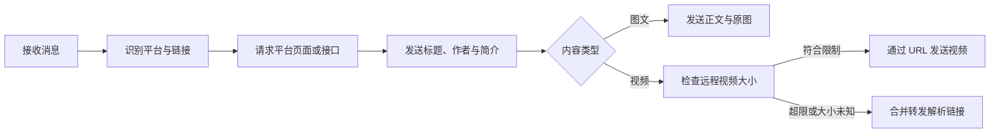

# AstrBot 多平台内容解析器

> [!IMPORTANT]
> 本项目采用纯 AI 编程完成。

> 自动识别聊天消息中的 Bilibili、抖音、小红书、微博、小黑盒和知乎链接，并发送作品信息、正文图片或视频。


## 功能概览

- **自动识别链接**：无需命令，直接发送受支持的链接或分享卡片即可触发解析。
- **覆盖六个平台**：支持 Bilibili、抖音、小红书、微博、小黑盒和知乎的常见视频、图文及分享链接。
- **保留原图质量**：图片在内存中下载后以原始字节发送，不主动缩放或转码。
- **合理组织多图**：图片较多时，在支持的协议端使用合并转发，减少群聊刷屏。
- **控制视频体积**：发送前探测远程视频大小，超过限制时改为发送解析链接。
- **按需配置 Cookie**：所有平台 Cookie 均为可选项，可提高受登录态或风控影响内容的解析成功率。

## 支持范围

| 平台 | 视频 | 图文 | 短链 | 其他内容 |
| --- | :---: | :---: | :---: | --- |
| Bilibili | BV 号、AV 号 | Opus 图文、专栏 | `b23.tv`、`bili2233.cn` | 动态 |
| 抖音 | 大陆抖音视频 | 普通图文、Slides | `v.douyin.com`、`jx.douyin.com` | 分享页链接 |
| 小红书 | 视频笔记 | 图文笔记 | `xhslink.com` | 部分 JSON 分享卡片 |
| 微博 | 普通视频、微博视频页、TV | 普通微博、转发微博、长文章 | `mapp.api.weibo.cn` | 桌面端和移动端微博 |
| 小黑盒 | 帖子视频、游戏视频 | 社区帖子、游戏截图 | BBS/API 分享链接 | 游戏简介、评分与价格 |
| 知乎 | 正文内视频 | 问题、回答、专栏文章、想法 | `link.zhihu.com` | 页面数据回退解析 |

> [!NOTE]
> 当前不支持 TikTok，也不解析 Bilibili 音频、独立音轨或 `au` 号。

## 快速开始

### 安装

推荐通过 AstrBot 插件市场安装。手动安装时，将插件目录放入 AstrBot 的 `data/plugins/` 目录，并确保运行环境已安装 `requirements.txt` 中声明的依赖。

当前仅依赖：

```text
httpx
```

安装或更新后，在 AstrBot 管理面板中重新加载插件，并按需调整插件配置。

### 使用

插件监听所有消息类型。发送包含受支持链接的消息后，它会自动完成以下流程：



无需添加命令前缀。例如，下面这些内容都可以直接触发对应解析器：

```text
https://www.bilibili.com/video/BV...
https://v.douyin.com/...
https://www.xiaohongshu.com/explore/...
https://weibo.com/1234567890/ABCDEF
https://www.xiaoheihe.cn/app/bbs/link/...
https://www.zhihu.com/question/123456789
```

## 配置说明

所有配置均可在 AstrBot 插件配置页面中修改。

| 配置项 | 类型 | 默认值 | 说明 |
| --- | --- | --- | --- |
| `enabled_platforms` | 列表 | 六个平台全部启用 | 需要启用的解析器 |
| `douyin_cookies` | 文本 | 空 | 可选；缺少 `ttwid` 时会尝试注册匿名会话 |
| `redbook_cookies` | 文本 | 空 | 可选；可提高部分内容或无水印资源的可用性 |
| `weibo_cookies` | 文本 | 空 | 可选；用于需要登录态的微博页面请求 |
| `xiaoheihe_cookies` | 文本 | 空 | 可选；未配置时自动申请匿名设备令牌 |
| `zhihu_cookies` | 文本 | 空 | 可选；用于知乎页面和接口请求 |
| `request_timeout_seconds` | 整数 | `30` | 平台页面和接口请求超时，单位为秒 |
| `send_video_by_url` | 布尔值 | `true` | 是否通过远程 URL 直接发送解析到的视频 |
| `max_video_size_mb` | 浮点数 | `50` | 视频直发体积上限，单位为 MB；小于等于 `0` 表示不限制 |
| `allow_unknown_video_size` | 布尔值 | `false` | 无法探测视频大小时，是否仍尝试直接发送 |
| `size_check_timeout_seconds` | 浮点数 | `10` | 视频大小探测超时，单位为秒 |
| `enable_parse_reaction` | 布尔值 | `true` | 识别到受支持链接后，是否给原消息添加表情回应 |
| `reaction_action` | 字符串 | `set_msg_emoji_like` | OneBot 表情回应动作名，需与协议端保持一致 |
| `reaction_emoji_id` | 字符串 | `124` | 表情回应使用的表情 ID |

### 常用配置示例

**仅启用 Bilibili 和小红书：**

```json
{
  "enabled_platforms": ["bilibili", "redbook"]
}
```

**不直接发送视频，只返回解析链接：**

```json
{
  "send_video_by_url": false
}
```

**取消视频体积限制：**

```json
{
  "max_video_size_mb": 0
}
```

> [!WARNING]
> Cookie 属于敏感信息。请仅通过 AstrBot 配置或环境管理能力提供，不要写入代码、README、Issue 或日志。

## 消息发送策略

### 图文内容

1. 插件先整理标题、作者、简介等元数据。
2. Bilibili 图文按正文、图片和图片失败提示在原内容中的顺序发送。
3. 图片会下载到内存并编码为 Base64，不写入本地文件或缓存。
4. 当图片槽位不少于 3 个时，`aiocqhttp` 和 `satori` 会先发送普通简介，再用合并转发发送正文与图片；其他平台适配器使用普通消息链。
5. 单张图片下载失败时，原位置会显示“第 N 张图片获取失败”，其余内容继续发送。

### 视频内容

启用 `send_video_by_url` 后，插件只通过 `HEAD` 或 `Range` 请求探测文件大小，不会把完整视频下载到本地。

| 检查结果 | 处理方式 |
| --- | --- |
| 文件大小未超过 `max_video_size_mb` | 通过远程 URL 单独发送视频 |
| 文件大小超过限制 | 使用 OneBot 合并转发发送解析链接 |
| 文件大小未知，且不允许未知大小 | 使用 OneBot 合并转发发送解析链接 |
| 文件大小未知，但允许未知大小 | 尝试通过远程 URL 发送视频 |
| 合并转发调用失败 | 降级为普通文本，附带失败原因和视频链接 |

插件会先发送作品信息，再处理视频。即使视频发送失败，已经解析到的标题和封面仍会保留。

## 常见问题

<details>
<summary><strong>为什么解析成功了，却没有直接发出视频？</strong></summary>

视频可能超过 `max_video_size_mb`，也可能无法通过 `HEAD` 或 `Range` 获取大小。此时默认改用合并转发发送解析链接。可以根据协议端能力调整 `max_video_size_mb` 或 `allow_unknown_video_size`。

</details>

<details>
<summary><strong>为什么视频 URL 在协议端发送失败？</strong></summary>

插件不会下载视频，而是让协议端拉取远程 URL。协议端通常无法携带插件请求使用的 Cookie 或 Referer，因此部分有防盗链或时效限制的 CDN 地址可能失效。

</details>

<details>
<summary><strong>为什么图片看起来被压缩了？</strong></summary>

插件发送的是平台源文件字节，不会主动缩放或转码 JPEG、WebP 等图片。协议端或目标聊天平台仍可能在接收后再次压缩。

</details>

<details>
<summary><strong>为什么表情回应没有出现？</strong></summary>

表情回应依赖 OneBot 客户端支持 `reaction_action` 指定的动作。动作不可用、消息 ID 缺失或调用失败时只记录日志，不会中断内容解析。

</details>

<details>
<summary><strong>为什么同一个链接突然无法解析？</strong></summary>

平台页面结构、公开接口、签名规则和 CDN 策略都可能变化。可以先检查 Cookie 与网络连通性；如果多个链接同时失效，通常需要更新对应平台解析器。

</details>

## 安全与隐私

- 各平台 Cookie 仅随对应平台域请求发送，不会带到分享跳转目标或跨域图片 CDN。
- 小黑盒未配置 Cookie 时会向其设备指纹服务申请匿名设备 ID，不会上传聊天内容或用户凭据。
- 图片地址必须使用 HTTP(S)、默认端口和受信任的平台域名；私有地址及不安全重定向会被拒绝。
- 图片重定向最多跟随 5 次，并在每次跳转前重新校验目标地址。
- 图片错误日志仅记录主机名和错误摘要，避免泄漏带令牌的完整 URL。
- 图片仅在内存中短暂处理；视频始终使用远程 URL，不创建本地媒体缓存。

## 项目结构

```text
astrbot_multi_parser/
├── main.py                 # 插件入口、消息分发和发送策略
├── models.py               # 解析上下文、统一结果模型和图片安全处理
├── utils.py                # 消息文本与分享卡片提取
├── platforms/
│   ├── bilibili.py         # Bilibili 解析器
│   ├── douyin.py           # 抖音解析器
│   ├── redbook.py          # 小红书解析器
│   ├── weibo.py            # 微博解析器
│   ├── xiaoheihe.py        # 小黑盒解析器
│   └── zhihu/              # 知乎解析器包
├── tests/                  # pytest 测试
├── _conf_schema.json       # AstrBot 插件配置定义
├── metadata.yaml           # 插件元数据
├── THIRD_PARTY_NOTICES.md  # 第三方代码归属与许可证
└── requirements.txt        # Python 依赖
```

解析器统一继承 `models.py` 中的 `BaseParser`，并返回 `ParseResult`。新增平台时，通常需要：

1. 在 `platforms/` 中实现新的解析器类。
2. 实现链接匹配、内容解析和图片物化逻辑。
3. 在 `platforms/__init__.py` 导出解析器。
4. 在 `main.py` 注册解析器名称与实例。
5. 在 `_conf_schema.json` 的 `enabled_platforms` 提示中补充平台名称。
6. 为正常输入、空值、格式错误和网络失败添加测试。

## 开发与验证

请在项目配置的 Conda 或其他虚拟环境中执行命令，不要在 Conda `base` 环境安装依赖。

```powershell
# 快速检查 Python 语法
python -m compileall .

# 运行全部测试
python -m pytest

# 运行单个平台测试
python -m pytest tests/test_bilibili.py -q
```

涉及插件加载、协议端媒体发送或表情回应的修改，还需要通过 AstrBot 本地开发实例进行集成验证。

## 已知限制

- 平台页面和公开接口发生变化后，对应解析器可能需要同步更新。
- 远程视频能否发送，取决于协议端及目标聊天平台是否支持远程视频 URL。
- 多图合并转发目前仅对 `aiocqhttp` 和 `satori` 启用。
- 视频链接的有效期、防盗链策略和可访问区域由内容平台决定。
